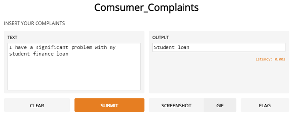
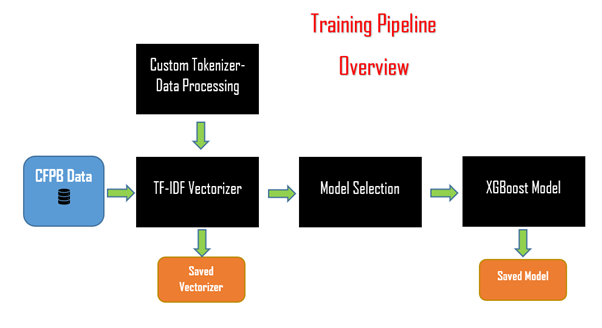
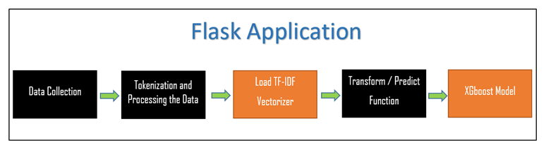
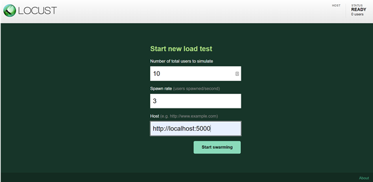
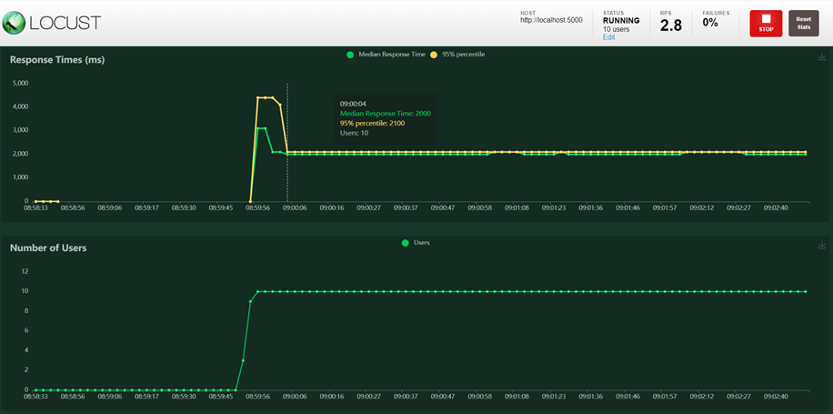
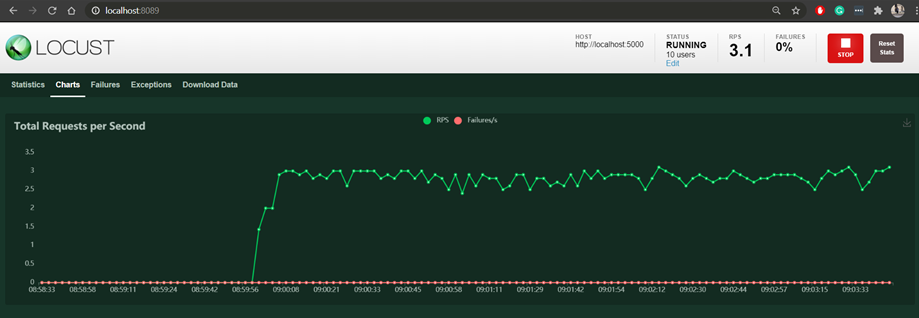
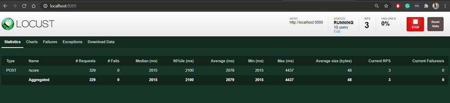

# Customer_complaints_model

Created Customer complaints Multi text classifier and served into a Scalable Flask application

• Processed the data, created a training pipeline using Tfidf vectorizer and Xgboost Algorithm

• Created a scalable Flask application using: Gunicorn and Ngnix

• Containerized the Application using Docker and Performed Load testing using Locust

# Running on your local machine 
Clone the repository 
you can run the following command to run it:

## Create your environment
$ python -m venv .venv

$ source .venv/bin/activate

## Install dependecies
$ pip install -r requirements.txt

## Run the Flask application
$ python Flask.py

## Text the application with any input 
$ curl http://localhost:5000/score -d "{\"text\":\"I Have a federal student loan\"}" -H 'Content-Type: application/json'

## Now let's Load test it with locust with the following command
$ locust -f loadtest.py

# Try to Simulate it with a different number of users and see how the latency is affected 

